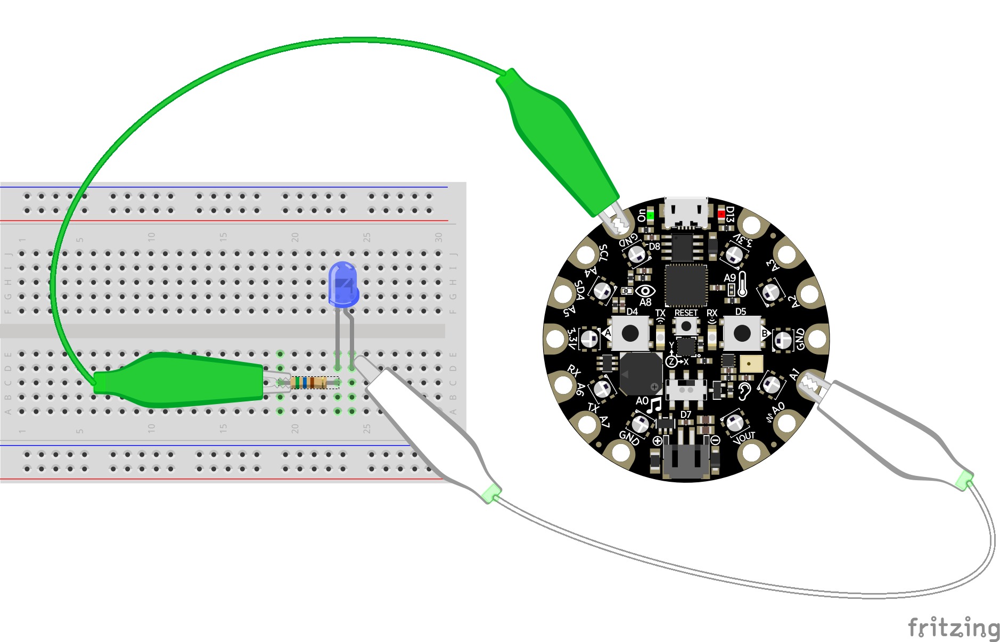
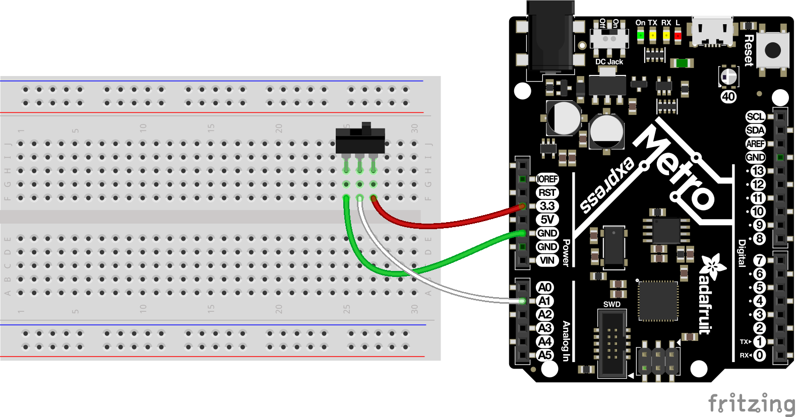
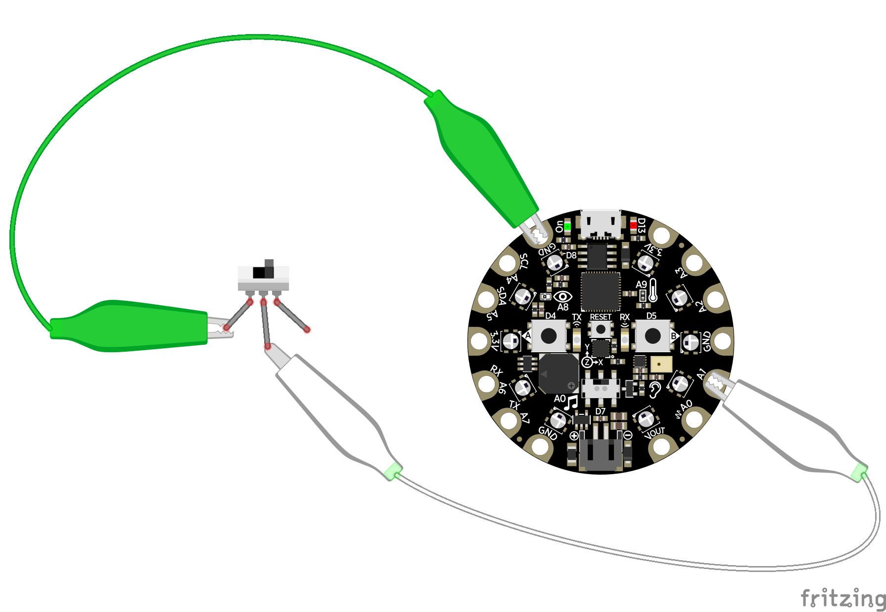

Digital Inputs & Outputs
========================

Digital inputs and outputs (or I/O) are some of the simplest and most powerful
ways to interact with hardware.  Using digital I/O you can talk to devices with
simple on and off signals, like turning a LED on/off or reading if a button is
pressed.  In CircuitPython using digital I/O is easy with a few modules that
this guide will explore.

Digital Signals
---------------

Before diving in to how to digital I/O works you'll want to understand what is a
digital signal.  In the simplest sense a digital signal is a simple on or off
signal--i.e. there are only two possible states for the signal to be in.  Think
of this almost like a binary digit that's either 0 or 1.  With a digital signal
it can only ever be 0/off or 1/on, there is no in-between!

At a physical level digital signals are represented with high and low voltage
levels.  A digital signal that's on will be at a 'high' voltage level, typically
3.3 volts or more (depending on the specifications of your microprocessor or
development board), and a signal that's off will be at a 'low' voltage level of
zero volts (also called ground).  You can actually see this voltage with a
multimeter set to measure DC voltage--try connecting a multimeter to a button or
LED and watch the voltage as digital signal changes from on to off and
vice-versa.

Examples of Digital Signals
---------------------------

What can you do with a digital signal?  It turns out quite a few interesting
components are controlled with simple on/off digital I/O!

Digital inputs:

- `Buttons and switches <https://www.adafruit.com/category/155>`_
- `Magnetic or hall-effect sensors <https://www.adafruit.com/product/158>`_
- `PIR motion sensors <https://www.adafruit.com/product/189>`_
- `Simple vibration sensors <https://www.adafruit.com/product/1766>`_
- `Beam-break sensors <https://www.adafruit.com/product/2167>`_
- `Liquid level sensors <https://www.adafruit.com/product/3397>`_
- `Tilt switches <https://www.adafruit.com/product/173>`_
- `Simple wireless remote controls <https://www.adafruit.com/product/1096>`_

Digital outputs:

- `Single color LEDs <https://www.adafruit.com/category/90>`_
- `Relays to control high-power devices <https://www.adafruit.com/product/2935>`_
- `Solenoids that push or pull objects <https://www.adafruit.com/product/2776>`_
- `Vibration motors <https://www.adafruit.com/product/1201>`_
- `Buzzers (not piezo buzzers that require an analog signal though!) <https://www.adafruit.com/product/1536>`_

In addition to devices like the above you can also use digital signals for
simple communication between two devices.  A digital output of one device, like
your development board, can be connected to another device's digital input, like
an `audio FX board <https://www.adafruit.com/product/2217>`_ that plays music
and sound effects.  There are even fast protocols like I2C or SPI for sending
large amounts of data over a digital signal, but we'll cover those in a later
guide.

Board Pins
----------

To use digital I/O you need to learn how to access the pins on your board. These
are the physical points where you connect wires to access the digital signals.
On some boards, like Metro M0 Express, the digital I/O pins are exposed with
female headers that work well with breadboard-friendly hookup wires.  On other
boards like Circuit Playground Express and Gemma M0 the digital I/O pins are
large copper pads with holes that are easy to connect to alligator clips or
conductive thread.  Check your board's documentation to see where all of the
digital I/O pins are located.

In CircuitPython you use the board module to reference digital I/O pins.  The
:py:mod:`board` module contains an object for each pin on the board and they're
typically named after labels on the board.  You can list all of the pins in the
board module with `Python's dir function
<https://docs.python.org/3.4/library/functions.html#dir>`_, for example from a
board's REPL run:

  >>> import board
  >>> dir(board)
  ['A0', 'SPEAKER', 'A1', 'A2', 'A3', 'A4', 'SCL', 'A5', 'SDA', 'A6', 'RX',
  'A7', 'TX', 'LIGHT', 'A8', 'TEMPERATURE', 'A9', 'BUTTON_A', 'D4', 'BUTTON_B',
  'D5', 'SLIDE_SWITCH', 'D7', 'NEOPIXEL', 'D8', 'D13', 'REMOTEIN', 'IR_RX',
  'REMOTEOUT', 'IR_TX', 'IR_PROXIMITY', 'MICROPHONE_SCK', 'MICROPHONE_DO',
  'ACCELEROMETER_INTERRUPT', 'ACCELEROMETER_SDA', 'ACCELEROMETER_SCL',
  'SPEAKER_ENABLE', 'SCK', 'MOSI', 'MISO', 'FLASH_CS']

Each of the objects returned by the dir command represents a named pin on the
board.  Above you see the output on a Circuit Playground Express board which has
pins like A0, A1, D4, D5, etc. that represent pins that run around the diameter
of the board.  There are even named pins like BUTTON_A, BUTTON_B, and
SLIDE_SWITCH that represent pins connected to components built-in to the board.

Digital Outputs
---------------

Controlling a digital output with CircuitPython is easy to do with a few lines
of code.  In fact you can connect to a board's REPL and directly turn digital
outputs on and off with a few simple commands.

An easy way to demonstrate digital outputs is with a simple single-color LED.
You can connect a LED to a digital output of your board and turn it on or off by
setting the output to a high or low voltage level.  Remember digital outputs are
only on or off and never in-between so you can't control the brightness of the
LED!  To wire a LED to your board you'll need these components:

- `A single color LED. <https://www.adafruit.com/product/777>`_  You want a simple single color LED and not a fancier multi-color LED or NeoPixel.  Look for a LED that has two legs, a short one and long one.  Check out `the Adafruit LED guide <https://learn.adafruit.com/all-about-leds/overview>`_ for more details on LEDs.
- `A resistor in the range of 300-1,000 ohms. <https://www.adafruit.com/product/2781>`_  You *must* use a resistor when wiring up a LED to your board or else you might damage the digital output on the board.  The resistor limits the amount of current to the LED and prevents damage to the board or LED.  The exact value of the resistor isn't super important for this demonstration--pick any resistor in the 300-1,000 ohm range.
- A breadboard and wires to connect the components and board together.

Connect the components to your board as follows:

- The short leg (cathode) of the LED connects to one end of the resistor.
- The other end of the resistor connects to the ground or GND pin of the board.
- The long leg (anode) of the LED connects to a digital output on your board.

Now connect to your board's REPL and you can use the :py:mod:`digitalio` module
to control the digital output connected to the LED.  Run the following code to
first import the necessary modules and create a
:py:class:`digitalio.DigitalInOut` object for the pin (pin A1 in this example
but you can use any digital output from your board):

  >>> import board
  >>> import digitalio
  >>> led = digitalio.DigitalInOut(board.A1)

The :py:class:`digitalio.DigitalInOut` class is your gateway for controlling
both digital inputs and outputs.  By default when you create an instance of one
it starts as a digital input, however you can set the
:py:attr:`digitalio.DigitalInOut.direction` property to make it an output:

  >>> led.direction = digitalio.Direction.OUTPUT

Once a digital output is created and initialized you simply change the value of
its :py:attr:`digitalio.DigitalInOut.value` property to turn the output on or
off.  For example to turn the LED on set value to true:

  >>> led.value = True

And to turn the LED off set value to false:

  >>> led.value = False

Remember with digital signals you can only set them to on or off states, i.e.
true or false values.  There is no in-between or half on and half off!

Finally you can blink the LED by simply changing the value in a loop with a
small delay:

  >>> import time
  >>> while True:
  ...    led.value = True
  ...    time.sleep(0.5)
  ...    led.value = False
  ...    time.sleep(0.5)
  >>>

Remember in the REPL you need to press delete to de-indent the while loop and
then press enter for it to see you're done typing code in the loop!
Alternatively press enter three times an CircuitPython will automatically close
the loop and run it.  You can press Ctrl-C to stop the loop from running with a
keyboard interrupt exception.

Digital Inputs
--------------

Just like digital outputs, digital inputs are easy to control with a few lines
of CircuitPython code.  A great example of using digital inputs is reading the
state of a button or switch.  To do this you'll need the following parts:

- A `slide switch <https://www.adafruit.com/product/805>`_ or toggle switch. These are switches that have three legs and physically connect one of the legs to another when the switch is flipped.  You'll see two different ways to wire this switch to your board--one that uses all three legs and another that uses just two legs.
- A breadboard and wires to connect the components and board together.

Wire up the switch to your board as follows:

- The middle leg or output of the switch is connected to one of the digital inputs of the board.
- Another leg of the switch is connected to the board's ground or GND pin. When the switch is flipped to this position it will read a low digital logic signal.
- The opposite leg of the switch is connected to the board's 3.3V output.  You want to connect this switch to a voltage output that matches your board's voltage for a high digital logic signal, typically 3.3V but sometimes 5V.  When the switch is flipped to this position it will read a high digital logic signal.

Now connect to the board's REPL and create a digital input object just like you
saw previously with digital outputs.  For example using pin A1 of a board:

  >>> import board
  >>> import digitalio
  >>> switch = digitalio.DigitalInOut(board.A1)

By default :py:class:`digitalio.DigitalInOut` objects are created as digital
inputs so you don't need to do anything else to read the switch.  However if you
were doing other things with the pin you can use
:py:attr:`digitalio.DigitalInOut.direction` property and set it to an input:

  >>> switch.direction = digitalio.Direction.INPUT

After a digital input object is created you simply read the
:py:attr:`digitalio.DigitalInOut.value` property to check if the input is at a
high or low logic level.  If the value is a boolean true value it's at a high
digital logic level and if it's false it's at a low digital logic level.

Try reading the switch state, for example you might see:

  >>> switch.value
  False

Then flip the switch to its opposite position and read it again:

  >>> switch.value
  True

Notice the value changed from false to true!  This shows that the board first
saw the digital input connected to ground or low digital logic level and then
saw the input connected to 3.3V or high digital logic level.  By flipping the
switch you physically changed how the legs of the switch were connected to
switch between high and low levels!

Remember you can use boolean values in conditional statements, like to print out
a message if the switch is turned on:

  >>> if switch.value:
  ...     print("Switch is on!")
  ... else:
  ...     print("Switch is off!")
  Switch is on!

There's one other way to read the switch which only requires two of its legs to
be connected to your board.  This is useful to reduce the number of physical
connections or to connect to momentary or push buttons that only have two legs.
Change the wiring of the switch to look like:

- The middle leg or output of the switch is still connected to one of the digital inputs of the board.
- Another leg of the switch is connected to the board's ground or GND pin.

The opposite leg of the switch remains disconnected--only two wires are
connected to the switch.  When the switch is wired like this it means it will
read a ground or low logic level in one position, but what happens when it's in
the opposite position and not connected to anything on the board?  This state is
called 'floating' and the input will actually read random values--you might get
a high or low logic level depending on the electrical noise around the pin!

Luckily there's an easy way to prevent an input from floating by using special
built-in pull-up or pull-down resistors available on most development board
digital I/O pins.  You can turn on a pull-up resistor that will bring the
digital input up to a high digital logic level if nothing is connected to it.
This prevents the input from floating and will instead read a high digital logic
level.  Then when the switch is flipped and connected to ground / low logic it
will 'overpower' the small pull-up resistor and read a low digital logic level.

To enable a digital input with a pull-up (or pull-down) resistor you can do so
with the :py:attr:`digitalio.DigitalInOut.pull` property:

  >>> switch.pull = digitalio.Pull.UP

Now the digital input is configured with a pull-up resistor!  Try reading the
value of the input with the  use the :py:attr:`digitalio.DigitalInOut.value`
attribute again:

  >>> switch.value
  False

Then flip the switch and read its value again:

  >>> switch.value
  True

Notice the switch value changes depending on how the switch is flipped.  When
the switch connects to ground you'll read a false or low digital logic level,
and when the switch connects to nothing (i.e. is floating) you'll read a true or
high logic level because of the pull-up resistor connected internally to 3.3V.

You don't have to be limited to just pull-up resistors too.  On some boards you
can specify pull-down resistors that pull the input to a ground or low logic
level, and you can even turn off the pull-up or pull-down.  Just specify a
different value for the pull parameter or attribute:

:py:data:`digitalio.Pull.UP`

    Set the input to have an internal pull-up resistor that reads a high digital
    logic level when nothing else is connected.

:py:data:`digitalio.Pull.DOWN`

    Set the input to have an internal pull-down resistor that reads a low
    digital logic level when nothing else is connected.

:py:data:`digitalio.Pull.NONE`

    Remove any pull-up or pull-down resistor.  The input will read whatever
    logic level is connected to it and 'float' to random high or low values if
    nothing is connected!

Alternative Usage
^^^^^^^^^^^^^^^^^

Above you saw how the :py:attr:`digitalio.DigitalInOut.direction` and
:py:attr:`digitalio.DigitalInOut.pull` properties let you set the input/output
and pull-up or pull-down resistor state of a pin.  As an alternative you can use
the :py:func:`digitalio.DigitalInOut.switch_to_output` and
:py:func:`digitalio.DigitalInOut.switch_to_input` functions to also set the
input/output and pull-up or pull-down resistor state.  These functions are handy
alternatives that can set both the direction and pull-up/pull-down state in one
call (see the pull parameter to the
:py:func:`digitalio.DigitalInOut.switch_to_input` function).

Remember you can explicitly import Python objects to make your code more compact
too, for example:

  >>> import board
  >>> from digitalio import DigitalInOut, Direction, Pull
  >>> led = DigitalInOut(board.A1)
  >>> led.direction = Direction.OUTPUT
  >>> led.pull = Pull.UP
