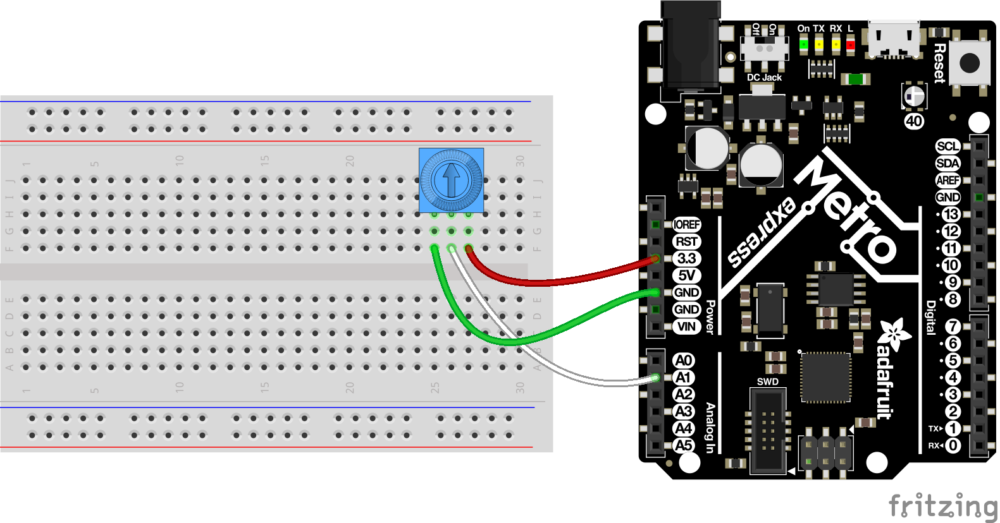
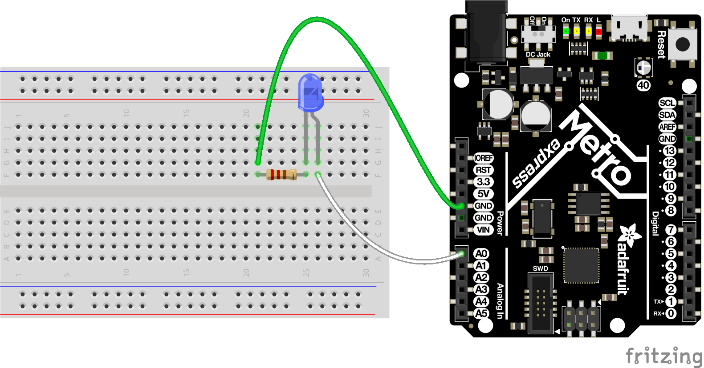

Analog Inputs & Outputs
=======================

Analog inputs and outputs are important for interacting with many types of
sensors and other devices.  This guide will explore what an analog signal is and
how it differs from digital signals, how to read analog signals, and how to
output analog signals with CircuitPython.

Analog Signals
--------------

Analog signals are different from digital signals in that they can be *any*
voltage.  Remember digital signals are only ever on (high logic level voltage
like 3.3V) or off (low logic level voltage like 0V / ground). Analog signals can
be a voltage in-between on and off like 1.8V.  Analog signals are also
continuous values which means they can be an *infinite* number of different
voltages.  Think of analog signals like a floating point or fractional number,
they can be *any* in-between value like 1.8V, 1.81V, 1.801V, 1.8001V, 1.80001V
and so forth to infinity!

Many devices use analog signals, in particular sensors typically output an
analog signal or voltage that varies based on something being sensed like light,
heat, humidity, etc.  Some examples of sensors with analog outputs:

- `Microphones <https://www.adafruit.com/product/1063>`_
- `Photocells (light sensitive resistors) <https://www.adafruit.com/product/161>`_
- `Temperature sensors <https://www.adafruit.com/product/165>`_
- `Force-sensitive resistors <https://www.adafruit.com/product/166>`_
- `Flex sensors <https://www.adafruit.com/product/1070>`_
- `Thermistor (temperature sensitive resistor) <https://www.adafruit.com/product/372>`_
- `Ultraviolet light sensor <https://www.adafruit.com/product/1918>`_
- `Light sensors <https://www.adafruit.com/product/2748>`_
- `Distance sensor <https://www.adafruit.com/product/164>`_
- `Anemometer (wind speed sensor) <https://www.adafruit.com/product/1733>`_
- `Resistive touch screen <https://www.adafruit.com/product/333>`_
- `Ultrasonic distance sensor <https://www.adafruit.com/product/979>`_
- `Liquid level sensor <https://www.adafruit.com/product/464>`_
- `Potentiometer (variable resistor) <https://www.adafruit.com/product/356>`_

The are also some devices that can be controlled by analog signals or varying
voltages:

- `Simple LEDs and other lights <https://www.adafruit.com/category/90>`_
- `Speakers <https://www.adafruit.com/product/1898>`_
- `Transistors (to amplify signals) <https://www.adafruit.com/product/756>`_

And there are some devices that are controlled by a special type of analog-like
signal called a pulse-width modulated, or PWM, signal.  You'll learn more about
PWM signals at the end of this guide, but some devices that can be driven by a
PWM signal are:

- `Simple LEDs and other lights <https://www.adafruit.com/category/90>`_
- `Servo motors <https://www.adafruit.com/product/169>`_
- `DC motors <https://www.adafruit.com/product/711>`_

Analog to Digital Converter (Inputs)
------------------------------------

An analog to digital converter (or ADC) is a device that reads the voltage of an
analog signal and converts it into a digital, or numeric, value.  The
microprocessor in your development board can't deal with analog signals directly
because they can be an *infinite* range of values.  However if the analog signal
is converted into a numeric value then it can be processed and reasoned about by
the microprocessor just like any other number.  The ADC is the key to reading
analog signals and voltages with a microprocessor.

Typically development boards have one or more built-in analog to digital
converters.  Check your board's documentation for details on the number of ADCs
and which pins are used as inputs for them (some boards like the Metro M0
Express and Circuit Playground Express note their analog inputs with names like
A0, A1, etc.).

Along with the number of analog to digital converters your board's documentation
also might mention the resolution or 'bits' used by the ADC.  The resolution of
the ADC controls how accurately it can read a voltage.  For example a 12-bit ADC
can represent analog voltages with 12-bit values, i.e. 0 to 4095 (use the
equation 2^12 - 1 to understand how the number of bits relates to the possible
values).  This means the 12-bit ADC can see 4096 different voltages (remember 0
is a unique value too).  That's a lot of voltages, but remember analog signals
have an infinite range of values so there might be cases where two measurements
aren't different enough for the ADC to measure and will appear as the same
numeric value!

To understand the accuracy of an ADC you also need to understand its range of
possible input values.  Again check your board's documentation to see how it
defines (or lets you define) its analog reference voltage.  The reference
voltage sets the range of possible input voltages the ADC can measure.  When the
ADC reads the voltage it will see where it falls within the range of input
voltages and output a number that falls within the same range of its bit
resolution.

For example if a 12-bit ADC has a reference voltage of 3.3 volts (a typical
value for most ADCs built-in to microprocessors) and reads a 2.5 volt value you
can calculate the value output by the ADC (try running this in an interactive
Python REPL):

  >>> int(2.5 / 3.3 * 4095)
  3102

This means the ADC would return a value of 3102 for an input of 2.5 volts!  You
can try other input voltages too, like 0.1 volt:

  >>> int(0.1 / 3.3 * 4095)
  124

Notice it returns a much smaller value of 124.  What if you ever so slightly
increase the voltage to 0.1001 volts?

  >>> int(0.1001 / 3.3 * 4095)
  124

Wow you get the same 124 value even though the input voltage is slightly higher!
This highlights a constraint of analog to digital converters that their analog
reference range and bit resolution dictate the accuracy of voltage measurements.
If you want to read very small changes in voltage you need a higher bit ADC,
like 24 or even 32 bits of range, or a much smaller and more constrained
reference voltage range.

To demonstrate the analog to digital converter you can read the voltage output
by a potentiometer.  A potentiometer is a small variable resistor that you can
twist a knob or shaft to change its resistance.  By wiring the potetiometer to
your board in a special way (called a voltage divider) you can turn the change
in resistance into a change in voltage that your board's analog to digital
converter can read.  You'll need the following parts to try this:

- `A potentiometer. <https://www.adafruit.com/product/356>`_  Almost any potentiometer will work as long as it has 3 pins.  A potentiometer is like a resistor and classified by its resistance in ohms (typically 1, 10, 100, etc. kilo-ohms).  By twisting the knob or shaft on the potentiometer you can change the resistance of the middle pin (called the wiper) to be anywhere inbetween the range of resistance of the potentiometer.
- A breadboard and wires to connect the components and board together.

Connect the components to your board as follows:

- One of the outer legs of the potentiometer to the board ground or GND pin.
- The opposite outer leg of the potentiometer to the board 3.3 volt output.
- The middle leg of the potentiometer to an analog input of the board, like A0.

Now at the REPL import the :py:mod:`analogio` and :py:mod:`board` module to create an instance of the :py:class:`analogio.AnalogIn` class:

  >>> import board
  >>> import analogio
  >>> adc = analogio.AnalogIn(board.A0)

Notice the :py:class:`analogio.AnalogIn` class initializer needs to be told
which pin will be used as the analog input.  In this case the board pin A0 is
being used as the ADC input.

Once the analog input is initialized you're ready to start reading from it with
the :py:attr:`analogio.AnalogOut.value` property.  Simply read the value
property to see the numeric output of the ADC:

  >>> adc.value
  32683

Try twisting the knob of the potentiometer and reading the value property again,
for example twist the knob all the way towards the ground input:

  >>> adc.value
  65

If you read the value a few times you might notice the value changes a bit but
stays around a low value near zero.  Remember analog signals can be an infinite
range of values so even though the potentiometer knob hasn't moved, the voltage
read by the ADC might be very slightly changing based on heat, electrical
interference, vibrations, etc. that can affect analog devices and signals.

If you twist the knob of the potentiometer all the way to the other extreme near
3.3 volts and read its value:

  >>> adc.value
  65476

You should see a very high value near 65000.  As the voltage to the analog input
increased the ADC value increased too!

As an aside if you have a multimeter try using it to measure the voltage output
from the potentiometer.  Connect the positive lead of the probe to the center
output pin of the potentiometer and the ground lead of the probe to the ground
pin of your board or potentiometer.  Set the meter to read DC voltage and watch
how the voltage and ADC value change as you twist the potentiometer knob.
Remember the ADC is just converting the voltage into a number so as the voltage
measured by the meter increases you'll also see the ADC value increase!

For ADC values in CircuitPython you'll find they're all put into the range of
16-bit unsigned values.  This means the possible values you'll read from the ADC
fall within the range of 0 to 65535 (or 2^16 - 1).  Remember when you twisted
the potentiometer knob to be near ground you saw a value close to zero and when
you twisted it to the other extreme near 3.3 volts you saw a value close to
65535--you're seeing almost the full range of 16-bit values!

One important note about this 16-bit range is that it applies even if your
board's ADC has a different resolution (like 10 or 12 bits).  Using 16-bits as a
base resolution is handy to make code work across many different boards but be
aware you might not actually be getting 16-bits of resolution from your ADC.
Check your board's documentation to see the true resolution of its ADC.

Finally there's one more handy property of the :py:class:`analogio.AnalogIn`
class, the :py:attr:`analogio.AnalogOut.reference_voltage`.  This property lets
you read the reference voltage used by the ADC to convert voltages into numbers.
This is useful to convert the number you read from the ADC into an actual
voltage value.  Try running this code to read the ADC value and convert it into
voltage using the reference voltage:

  >>> adc.value / 65535 * adc.reference_voltage
  3.2998

Twist the potentiometer knob and run the same line again to see how the voltage
value changes!

Digital to Analog Converter (Outputs)
--------------------------------------

A digital to analog converter (also called a DAC) is a piece of hardware that
can take a numeric, or digital, value and turn it into a voltage, or analog
value.  This is useful for interfacing with devices that expect varying analog
signals, like controlling the intensity of a LED or driving a speaker to play
sounds.  Not all boards and processors support a digital to analog converter so
check your board's documentation to see if it has such a feature.  Luckily the
Atmel SAMD21 processor used in many CircuitPython boards like the Circuit
Playground Express and Metro M0 express have a digital to analog converter
built-in.

To demonstrate the digital to analog converter you can control the voltage
output by a pin to brighten and dim a LED.  You'll need the following
components:

- `A single color LED. <https://www.adafruit.com/product/777>`_  You want a simple single color LED and not a fancier multi-color LED or NeoPixel.  Look for a LED that has two legs, a short one and long one.  Check out `the Adafruit LED guide <https://learn.adafruit.com/all-about-leds/overview>`_ for more details on LEDs.
- `A resistor in the range of 300-1,000 ohms. <https://www.adafruit.com/product/2781>`_  You *must* use a resistor when wiring up a LED to your board or else you might damage the digital output on the board.  The resistor limits the amount of current to the LED and prevents damage to the board or LED.  The exact value of the resistor isn't super important for this demonstration--pick any resistor in the 300-1,000 ohm range.
- A breadboard and wires to connect the components and board together.

Connect the components to your board as follows:

- The short leg (cathode) of the LED connects to one end of the resistor.
- The other end of the resistor connects to the ground or GND pin of the board.
- The long leg (anode) of the LED connects to a the digital to analog converter output of your board.  You might need to check your board's documentation to find this pin.  On the Metro M0 Express and Circuit Playground Express looks for the A0 pin with a squiggly line next to it (the squiggle indicates this pin is a DAC output).

Now at the REPL import the :py:mod:`analogio` and :py:mod:`board` module to
create an instance of the :py:class:`analogio.AnalogOut` class:

  >>> import board
  >>> import analogio
  >>> led = analogio.AnalogOut(board.A0)

Just like with an analog input the :py:class:`analogio.AnalogOut` class
initializer needs to be told which pin will be used as the output.  In this case
the board pin A0 is being used as the DAC output.

Once the AnalogOut class is created you're ready to control its voltage.  You
can change the voltage by updating the :py:attr:`analogio.AnalogOut.value`
attribute.  Just like with an analog input the range of possible values go from
0 to 65535, or all 16-bit unsigned integer values.  For example to set the value
to 0, or ground, and turn off the LED:

  >>> led.value = 0

And to turn on the LED to maximum brightness with the highest possible voltage
output value use the value 65535:

  >>> led.value = 65535

Notice the LED turns on very brightly!  Now try changing the value to a slightly
lower value, like 50000:

  >>> led.value = 50000

You should see the LED light up less bright.  Try experimenting with setting
different values in the range of 0 to 65535 and notice how the LED responds.

One thing you might see is if the value is set to a low number, like 10000, the
LED turns off just like if the value was set to 0.  The reason for this is that
the LED has a minimum voltage before it turns on and starts emitting light.  For
most LEDs this voltage is around 1.8 to 2 volts and with a low enough value like
10000 the voltage output by the DAC is below the LED's 'turn on' (or forward)
voltage.

As a side note if you have a multimeter that measures DC voltage try hooking up
the probes to measure the voltage output by the A0 pin.  Put the positive probe
on the A0 output or LED anode and the negative probe on the board ground, then
measure the DC voltage.  As you set the value see how voltage read by the
multimeter changes!

Just like with an analog input the digital to analog converter converts its
digital value (the number like 10000) to a voltage based on an internal analog
reference voltage.  For the Metro M0 Express and Circuit Playground Express this
reference voltage is 3.3 volts, so a value of 65535 means a full 3.3 volt output
and a value of 0 means a 0 volt output.  An in-between value will set a
proportionally in-between voltage.

So a value of 10000 with a 3.3 volt reference voltage means you should see a DAC
output voltage of (try typing this equation in the Python REPL):

  >>> 10000 / 65535 * 3.3
  0.5035477225909819

A voltage of ~0.5 volts is too far below the ~2 volt threshold to turn on the
LED.  What if you try a higher value like 50000, what voltage should you expect?
Again you can compute it with the same equation:

  >>> 50000 / 65535 * 3.3
  2.517738612954909

So a value of 50000 means the output voltage is about 2.5 volts.  Enough to turn
on the LED but not very brightly.  Try setting the DAC value to other values
above 50000 to see how an increase in the voltage increases the brightness of
the LED!

Pulse-width Modulation (Outputs)
--------------------------------

Another way to generate analog signals is with a technique called pulse-width
modulation (or PWM).  Like using a digital to analog converter you can use PWM
to control the voltage output by a pin.  However PWM is actually using a very
high speed digital signal (either on or off, *never* in-between) to approximate
an analog value.  Not every device can work with or 'see' the varying voltages
output with PWM, but many devices like LEDs and servos work great with PWM.  The
advantage of using PWM is that it typically doesn't need special hardware from
the microprocessor like with a digital to analog converter.  In many cases you
can use any digital output as a PWM output!

Note that not every board and build of CircuitPython includes PWM support.
Currently the Trinket M0, Gemma M0, and other non-express M0 builds do not
include PWM output support.  You'll need to use a bigger board like Circuit
Playground Express or Metro M0 Express to access PWM outputs.

To explore PWM outputs we'll use one to dim and brighten a LED, just like with
using the digital to analog converter above.  You'll need the same components
and setup as with the DAC:

- `A single color LED. <https://www.adafruit.com/product/777>`_  You want a simple single color LED and not a fancier multi-color LED or NeoPixel.  Look for a LED that has two legs, a short one and long one.  Check out `the Adafruit LED guide <https://learn.adafruit.com/all-about-leds/overview>`_ for more details on LEDs.
- `A resistor in the range of 300-1,000 ohms. <https://www.adafruit.com/product/2781>`_  You *must* use a resistor when wiring up a LED to your board or else you might damage the digital output on the board.  The resistor limits the amount of current to the LED and prevents damage to the board or LED.  The exact value of the resistor isn't super important for this demonstration--pick any resistor in the 300-1,000 ohm range.
- A breadboard and wires to connect the components and board together.

Connect the components to your board as follows:

- The short leg (cathode) of the LED connects to one end of the resistor.
- The other end of the resistor connects to the ground or GND pin of the board.
- The long leg (anode) of the LED connects to a PWM output of your board.  You might need to check your board's documentation to find these pins, but typically any digital output capable pin will work.

Now at the REPL import the :py:mod:`pulseio` and :py:mod:`board` module to
create an instance of the :py:class:`pulseio.PWMOut` class:

  >>> import board
  >>> import pulseio
  >>> led = pulseio.PWMOut(board.A0)

Just like with using analog inputs and outputs you need to specify the board pin
as a parameter to the :py:class:`pulseio.PWMOut` class initializer.  However
there are more optional parameters which you might later choose to specify:

:py:obj:`frequency`

  Specify the frequency of the PWM signal in hertz.  The default is 500 hz, or
  500 times a second.

:py:obj:`duty_cycle`

  Specify the duty cycle of the signal, or percent of time that it's held at a
  high vs. low signal.  The default is 0, or a completely low / off signal, and
  can be any 16-bit unsigned value.  You'll learn more about duty cycle values
  further below.

:py:class:`variable_frequency`

  This boolean indicates if the frequency of the PWM output can be changed.  By
  default this is false which means the frequency can't be changed (but the duty
  cycle still can be changed).  It doesn't hurt to enable this boolean but there
  are a limited number of internal timers to support different variable
  frequency PWM outputs.  If you're not planning to change the frequency of the
  output leave this disabled.

For now stick with the defaults for frequency and duty cycle (500hz and 0%
respectively)--these values will work great to control the brightness of a LED.

Before you control the PWM output you'll want to understand how frequency and
duty cycle affect the output signal.  As mentioned earlier a PWM output isn't
actually an analog signal in the truest sense of the word--at *no* point is a
PWM output any voltage in-between fully on (~3.3V) or off (0V / ground).
However a PWM output can appear to many devices to be an in-between voltage by
very quickly turning itself on and off.

Imagine flicking a light switch on and off very quickly, like 30 times a second.
The light bulb would be changing so quickly your eyes might not even see the
change from on to off and back on again--it would appear to be solidly lit at a
moderate brightness.  Now imagine as you're quickly turning the light on and off
you hold it on slightly longer than you hold it off.  The light would appear to
be brighter because it's turned on more often than it's turned off!  Likewise if
you hold the switch off very slightly longer than on you would see the light
grow dimmer.  Your eyes are effectively 'averaging out' the fast changes and
seeing the light's overall brightness change.  Remember at no point is the light
actually in-between fully on or off--if your eyes were fast enough they would
actually see the light as flickering on and off!

With a PWM output the frequency is the rate at which the signal turns on and
off.  Typically you set this to a high value that's much faster than the device
you're connected to can see or measure.  For a LED any value greater than about
60-100hz is enough to appear to the human eye as unchanging.  For other devices
like servos they might expect a very specific PWM frequency like 50hz.

Duty cycle is the percent of time that a part of the PWM signal is fully on vs.
fully off.  Think of duty cycle like a knob you can twist from 0 to 100%, where
at 0% the signal is always turned off and never turns on, at 50% the signal is
on for exactly as much time as it's off, and at 100% it's always turned on.  You
can adjust the duty cycle to any in-between value, like 33.33%, to have the
signal turned on for 1/3 of the time and turned off for the remaining 2/3 of the
time.  By manipulating the duty cycle you have similar control as if you were
adjusting the voltage output by the pin!

Back to controlling the LED, you can change the duty cycle by modifying the
:py:attr:`pulseio.PWMOut.duty_cycle` attribute.  Try setting the duty cycle to a
100% or fully on value with:

  >>> led.duty_cycle = 65535

Notice the LED turns on fully bright!  Now set the duty cycle to 0% or fully off
with:

  >>> led.duty_cycle = 0

The LED turns off!  Try an in-between value like:

  >>> led.duty_cycle = 32767

You should see the LED turn on at a moderate or half brightness.  Experiment
with setting different duty cycle values between 0% and 100% (or 0 and 65535
values) to see the LED brighten and dim.

The duty cycle value is a 16-bit unsigned number just like the value used by
digital to analog and analog to digital converters in CircuitPython.  You can
convert from a percentage value, like 66%, to a 16-bit duty cycle value with an
equation like:

  >>> int(66 / 100 * 65535)
  43253

Notice you can set any value in-between 0 to 65535 for the duty cycle and the
LED appears to brighten and dim, even all the way down to very low duty cycle
values like 1000 or less.  This is in contrast to the digital to analog
converter output where you saw below a large threshold there wasn't enough
voltage to turn on the LED.  Remember a PWM output is always either fully on or
fully off, it's never in-between.  As a result the PWM output will always be
able to light the LED, even at very low duty cycle values.  It's only the amount
of time the LED is turned on vs. off that changes--the less the LED is turned on
the less bright it appears to your eyes!

Try using a loop to go through all 0-100% duty cycle values and back:

  >>> import time
  >>> while True:
  ...    for i in range(100):
  ...        led.duty_cycle = int(i / 100 * 65535)
  ...        time.sleep(0.01)
  ...    for i in range(100, -1, -1):
  ...        led.duty_cycle = int(i / 100 * 65535)
  ...        time.sleep(0.01)
  >>>

You should see the LED fade from off to fully on and back down to off
repeatedly.  Press Ctrl-C to stop the loop and get back to the serial REPL.
