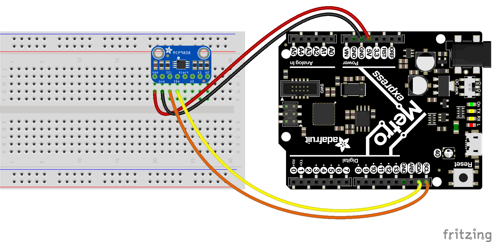
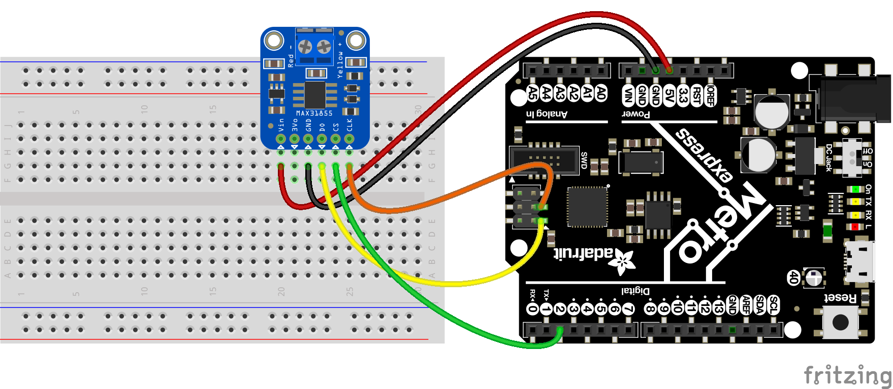

Talking to I2C & SPI Devices
============================

Talking to hardware from your development board is when the real fun starts with
a project.  You can connect sensors, actuators, and more to make your project
come alive with motion, sensation, sound, etc.  However to communicate with
other hardware typically requires knowledge of a serial protocol like I2C or
SPI.  These protocols are the common language that chips and add-on boards talk
so they can be connected to a development board.  The board knows how to 'speak'
these protocols and control the connected hardware.  This guide explores two
very common serial protocols, I2C and SPI.

I2C Devices
-----------

The I2C, or `inter-integrated circuit <https://en.wikipedia.org/wiki/I²C>`_,
protocol is one example of a serial protocol for devices to communicate with one
another.  I2C is a serial protocol because it has a clock line and single data
line which is used for both sending and receiving data.  Compared to other
serial protocols I2C has some interesting properties:

- The I2C protocol only uses 2 wires to send and receive data.  One line is a clock, called SCL, which pulses high and low to drive the sending and receiving of bits.  The other line is the data line, called SDA, which contains the value of a sent or received bit during clock line transitions.
- Multiple I2C devices can be connected to the same clock and data lines.  This means you can have many different sensors and devices all connected to the same couple pins from your development board.  The I2C protocol uses a 7-bit address assigned to each device as a way for the development board to talk to a specific device.  As a result of using 7-bit addresses the I2C protocol is limited to 127 unique devices connected to one bus (or pair of data and clock lines).
- The speed of the I2C bus is fixed, typically to 100khz, 400khz, or 1mhz.  This means I2C is a good protocol for talking to devices that don't send a lot of data or need very fast responses.  A TFT display which receives hundreds of kilobytes and even megabytes of image data wouldn't make sense as an I2C device because sending so much data over a 100khz bus would be quite slow.  However a small sensor like a temperature or light sensor that sends a small 16 or 32-bit value typically doesn't need a fast bus.
- The I2C clock and data lines need pull-up resistors to prevent from floating to random values.  Since many different devices can share these lines the I2C protocol requires that each device 'give up' or stop driving the lines when not in use.  If no device is driving the lines then the pull-up resistors ensure they go up to a high logic level instead of floating at random values.  Most I2C device boards (in particular the boards Adafruit creates) have these pull-up resistors built-in, but if you're talking to a chip or building a board yourself you might need to add ~10 kilo-ohm resistors connected from both data and clock lines up to high logic level.
- The I2C protocol includes a simple guarantee that data has been transferred between devices.  When one I2C device receives data from another device it uses a special acknowledgement bit to tell the sending device that data has been received.  There's no error correction, parity checks, etc.--just a simple yes/no that data has been successfully sent and received.
- Typically one device on an I2C bus is the 'master' which controls the clock line and sends requests to other connected devices.  In most cases your development board is the master device that drives the I2C bus clock.  Sensors and other I2C devices connected to the bus listen for requests from the master and respond appropriately.  This guide covers this most common scenario where your development board is the I2C master and is talking to connected devices.
- Many I2C devices expose data through a simple register table.  This means to query data from the device you need to know both the address of the device and the address of the register you wish to query.  Check your device's datasheet for the exact device and register address values.  Typically registers are 8-bit values (0 to 255) but devices are free to use larger or smaller sizes--always check your device's datasheet to be sure how it exposes data!

These properties make I2C an attractive protocol for sensors and other simple
devices that don't need to send or receive data quickly.  Many different sensors
can all be connected to the same I2C clock and data lines.  By giving each
sensor a unique 7-bit address your development board and code can query each one
for their current value.

To demonstrate interacting with an I2C device this guide will show you how to
query the temperature from a MCP9808 high precision temperature sensor.  This
sensor is a good example of an I2C device because it has a very simple register
structure.  To read the temperature you simply read one register from the
device--there's no complex logic or need to read other registers like on some
other sensors.  You'll need these parts to follow this section:

- `MCP9808 high precision temperature sensor <https://www.adafruit.com/product/1782>`_.
- A breadboard and wires to connect the components and board together.

Connect the components together as follows:

- Board 5V or 3.3V output to MCP9808 VDD or VIN.
- Board ground/GND to MCP9808 GND.
- Board SCL (I2C clock line) to MCP9808 SCL.
- Board SDA (I2C data line) to MCP9808 SDA.

Remember the I2C protocol requires pull-up resistors to be on the clock and data
lines.  If you're using an Adafruit breakout board like the MCP9808 sensor
linked above then these pull-ups are built-in and nothing else is necessary.
However if you're wiring a chip directly to your board or using a differnet
breakout you might need to add pull-up resistors.  Typically these are 4.7k -
10k ohm resistors that connect both clock and data up to high logic / 3.3V.

Once the device is wired up you're ready to start interacting with it from
CircuitPython.  The easiest way to demonstrate this control is from the serial
REPL and an interactive Python session.  Connect to your board's serial REPL,
then import the :py:mod:`board` and :py:mod:`busio` module:

  >>> import board
  >>> import busio

The :py:mod:`busio` module contains an interface for using hardware-driven I2C
communication from your board.  Note that on some boards, like the ESP8266, they
might not support hardware-driven I2C and must fall back to a slower software
driven approach.  You'll learn more about software driven, or bit-banged, access
later in this guide.  If you're not sure check your board's documentation for
its support of I2C--most boards like the Metro M0, Trinket M0, Gemma M0, Circuit
Playground Express support a hardware-driven I2C interface.

Within the :py:mod:`busio` module you'll use the :py:class:`busio.I2C` class to
create an interface to access the I2C bus:

  >>> i2c = busio.I2C(board.SCL, board.SDA)

When creating the I2C class you must specify the clock line and data line pins.
Typically these are the board.SCL and board.SDA objects but check your board's
documentation in case there are other hardware I2C buses with different clock
and data line names.

Once you have access to the locked I2C bus it's easy to scan the bus to find the
address of all devices connected to it.  Call the :py:func:`busio.I2C.scan`
function.

However before you make calls against the I2C bus you first need to take
control, or 'lock', it to ensure your code has exclusive access to I2C.  There
are a few ways to lock the bus like waiting on the :py:func:`busio.I2C.try_lock`
function and then calling the :py:func:`busio.I2C.unlock` function when finished
(typically in a Python try-finally block).  Locking the bus tells CircuitPython
that your code needs to use I2C and that any other code using I2C should wait
for your code to finish.  This helps different bits of code use the same
hardware peripherals by ensuring they don't try to use it at the same time or
interrupt each other.

To lock the I2C bus you want to use a special loop syntax that waits for the
`busio.I2C.try_lock` function to succeed:

  >>> while not i2c.try_lock():
  ...     pass
  ...
  >>>

This loop will continually call the try_lock function until it returns true that
the I2C bus was locked.  Remember other code might be using the bus so the loop
will keep trying to lock the bus and ensure it's available to use.  Once the bus
is locked you can start to call functions to access it, like scanning for any
available I2C devices.  Try calling the :py:func:`busio.I2C.scan` function to
list the addresses of all I2C devices found on the bus:

  >>> i2c.scan()
  [24]

Notice the :py:func:`busio.I2C.scan` function returns a list of 7-bit I2C device
addresses.  Be careful as Python treats these numbers as normal base 10 values
when printing them, whereas most I2C addresses from datasheets are in hex.  You
can use a special list comprehension syntax to convert the list of numbers into
hex strings:

  >>> [hex(x) for x in i2c.scan()]
  ['0x18']

Now you'll see a list of 2 digit hex strings which are easier to double check
with your device's datasheet.  In this case a device with address 0x18 is
visible on the I2C bus and if you check the `MCP9808 datasheet
<http://ww1.microchip.com/downloads/en/DeviceDoc/25095A.pdf>`_ you'll see by
default its I2C address is 0x18.  Perfect!  This means the sensor is properly
connected, powered, and responding to requests.

If for some reason you don't see anything returned by scan, or completely
different addresses then double check your wiring, power, and if pull-up
resistors are necessary to add.  If any one of those things isn't setup
correctly the device will not be visible to the I2C bus and scan.

Next you can read bytes from registers using a combination of writing and
reading functions.  With the I2C protocol all requests are actually transactions
where the master devices writes to and then reads from a connected device.
First the master writes the address of the register it wants to read, then it
reads a number of bytes from the device.

For example with the MCP9808 its temperature value is stored in a 16-bit
register at address 0x05.  You can read the value of this register by running:

  >>> i2c.writeto(0x18, bytes([0x05]), stop=False)
  >>> result = bytearray(2)
  >>> i2c.readfrom_into(0x18, result)
  >>> result
  bytearray(b'\xc1s')

Let's break down step by step what's happening here:

- First the :py:func:`busio.I2C.writeto` function is called to start an I2C transaction by writing bytes of data from the board to the MCP9808.  The first parameter is the address of the MCP9808, 0x18, and the second parameter is a list of bytes to be written.  In this case only one byte, the value 0x05, is written.  If you check the MCP9808 datasheet this 0x05 value is the temperature reading register.  Finally the stop=False keyword argument tells the write function that there are more calls to come in this I2C transaction.  Each I2C device can be different about how they expect transactions to be structured--some devices want an explicit stop after any master writes, whereas others expect the master to not send a stop and continue waiting for data from the device.  You'll need to check your device's datasheet to be sure how it expects I2C calls to work, but for the vast majority of I2C devices this write with stop=False is what they expect.
- After writing data from the board to the MCP9808 we need to receive two bytes of temperature sensor register data.  To do this we'll call the :py:func:`busio.I2C.readfrom_into` function.  But before you can call the function you need a place to store the returned bytes and to do this a bytearray of size 2 is created.  This result bytearray will be passed to the read function and then filled with the results read from the MCP9808.
- The :py:func:`busio.I2C.readfrom_into` function is finally called to read two bytes of data from the MCP9808.  Remember the I2C transaction is still 'open' from the previous write with stop=False so the MCP9808 knows to send back the previously requested temperature sensor register values.  Again the first parameter to the read function is the address of the device (0x18) and the second parameter is a bytearray that will be filled with the bytes that are read.  How does the function know how many bytes to read?  The size of the passed in bytearray by default will determine how many bytes to read, so if you need to read more or less bytes the easiest way is to change the size of the bytearray passed in.

The last statement prints the two bytes that were read, 0xC173.  This is the
response from the MCP9808 after it was asked to send the temperature sensor
register.  If you check the datasheet you can see the format for this response
actually encodes the sensed temperature. Luckily with Python it's easy to make a
function that decodes the temperature:

  >>> def temp_c(data):
  ...    value = data[0] << 8 | data[1]
  ...    temp = (value & 0xFFF) / 16.0
  ...    if value & 0x1000:
  ...        temp -= 256.0
  ...    return temp
  ...
  >>> temp_c(result)
  23.1875

Notice the temperature of the MCP9808 is printed in Celsius!

Once you're finished using I2C devices be sure to call the
:py:func:`busio.I2C.unlock` function to give back control of the I2C bus to
other code.  You can explicitly call it like:

  >>> i2c.unlock()

Or you can put your code in a try-finally block in Python which ensures the
unlock function is called no matter what, even if your code fails.  For example
a complete scan and read with try-finally might look like:

  >>> while not i2c.try_lock():
  ...     pass
  ...
  >>> try:
  ...     [hex(x) for x in i2c.scan()]
  ...     i2c.writeto(0x18, bytes([0x05]), stop=False)
  ...     result = bytearray(2)
  ...     i2c.readfrom_into(0x18, result)
  ... finally:
  ...     i2c.unlock()
  ...
  ['0x18']
  >>> result
  bytearray(b'\xc1s')

That's all there is to interacting with I2C devices from CircuitPython!  With
the :py:class:`busio.I2C` class you have direct access to crafting I2C
transactions of almost unlimited complexity.  Most devices will use the basic
write register, read bytes flow you saw here, but be sure to check your device's
datasheet in case it has different I2C protocol requirements.

An interesting property of most I2C devices is that they expose data with simple
registers.  Like you saw above with the MCP9808 sensor the register 0x05 held
the temperature as 2 bytes of data.  It's sometimes handy to scan all of the
registers of an I2C device and print out their values.  Here's an example of
scanning a set of registers from the first I2C device found and printing their
contents as hex (you might want to save this as a main.py file that runs at boot
instead of typing it all into the REPL!)::

  import board
  import busio

  REGISTERS = (0, 256)  # Range of registers to read, from the first up to (but
                        # not including!) the second value.

  REGISTER_SIZE = 2     # Number of bytes to read from each register.

  # Initialize and lock the I2C bus.
  i2c = busio.I2C(board.SCL, board.SDA)
  while not i2c.try_lock():
      pass

  # Find the first I2C device available.
  devices = i2c.scan()
  while len(devices) < 1:
      devices = i2c.scan()
  device = devices[0]
  print('Found device with address: {}'.format(hex(device)))

  # Scan all the registers and read their byte values.
  result = bytearray(REGISTER_SIZE)
  for register in range(*REGISTERS):
      try:
          i2c.writeto(device, bytes([register]))
          i2c.readfrom_into(device, result)
      except OSError:
          continue  # Ignore registers that don't exist!
      print('Address {0}: {1}'.format(hex(register), ' '.join([hex(x) for x in result])))

  # Unlock the I2C bus when finished.  Ideally put this in a try-finally!
  i2c.unlock()

For example with the MCP9808 you might see output like::

  Found device with address: 0x18
  Address 0x0: 0x0 0x1d
  Address 0x1: 0x0 0x0
  Address 0x2: 0x0 0x0
  Address 0x3: 0x0 0x0
  Address 0x4: 0x0 0x0
  Address 0x5: 0xc1 0x83
  Address 0x6: 0x0 0x54
  Address 0x7: 0x4 0x0
  Address 0x8: 0x3 0x1
  Address 0x9: 0x60 0x1
  Address 0xa: 0xa2 0x1
  Address 0xb: 0x25 0x88
  Address 0xc: 0x0 0x1

Also for interacting with most sensors and devices you typically don't need to
write these low-level direct I2C bus manipulation requests.  Instead look for a
higher level library to interact with the device, like the `CircuitPython
MCP9808 library <https://github.com/adafruit/Adafruit_CircuitPython_MCP9808>`_.
Using a library saves you the work of writing this low-level I2C code and
instead you can interact with simple temperature and other device properties.
However it is handy to know how to write low-level I2C transactions in case
you're dealing with devices that don't yet have a driver available!

SPI Devices
-----------

The SPI protocol, or `serial peripheral interface
<https://en.wikipedia.org/wiki/Serial_Peripheral_Interface_Bus>`_, is another
example of a serial protocol for two devices to send and receive data.  The big
difference between SPI and I2C is that SPI uses a few more wires, in particular
an explicit data input and data output wire instead of sharing a single data
wire like with I2C.  There's also a clock wire like in I2C, but with SPI it has
the freedom to use almost any speed it desires from a few kilohertz up to
hundreds of megahertz (if the hardware supports it!).  This makes the SPI
protocol great for devices like TFT displays that need to be sent very large
amounts of data--with control over the clock speed it's possible to very quickly
send entire screen images to the display.

Compared to I2C the SPI protocol has some interesting properties:

- SPI uses 3 to 4 wires for sending and receiving data.  One wire is a clock line that toggles up and down to drive bits being sent and received.  Like with I2C only the master device can drive the clock.  Another wire is MOSI, or 'master output, slave input' which is the data output from your board and sent to a connected device.  Likewise a MISO wire, or 'master input, slave output', is for sending data from the device to the board receiving it.  Finally most chips have a CS, or chip select, wire which is toggled to tell the chip that it should listen and respond to requests on the SPI bus.
- Like I2C multiple devices can share the same SPI bus, however a big difference is that each device typically requires its own unique CS line.  Remember the CS/chip select line is what tells a chip that it should listen for SPI traffic.  As a result for each SPI device you connect to your board it can share the clock, MOSI, MISO lines but must have its own CS line (typically connected to any free digital I/O pin).
- SPI devices have different requirements for speed (sometimes called baudrate), polarity, and phase.  The `SPI page on Wikipedia <https://en.wikipedia.org/wiki/Serial_Peripheral_Interface_Bus>`_ has a good description of what polarity and phase mean--they control how the data is sent and received over the MISO and MOSI lines.  Different polarity values control if a digital high or low logic level means a bit is a one or zero.  Similarly different phase values control when data is read and written by devices--either with the rising or falling edge of the clock line.  The important thing to know about phase and polarity is that each device has its own requirement for setting them so be sure to check your device's datasheet.  Many devices are 'mode 0' which means a polarity and phase of 0 but watch out because some devices use different modes.
- Like with I2C the basic operations are reading and writing bits and bytes of data over the data lines.  However unlike SPI there is no guarantee or check that a connected device received or sent data successfully.  Sometimes chips have extra lines to watch for an acknowledgment, but sometimes they don't and the SPI requests are 'fire and forget' with no guarantee they were received.

To demonstrate interacting with a SPI device this guide will show you how to
query the temperature from a MAX31855 thermocouple temperature sensor.  This
sensor is a good example of an SPI device because it has a very simple
interface, you just connect a MISO line and read bytes of temperature data.
There are no registers or other complex structures to configure and process on
the chip.  You'll need these parts to follow this section:

- `MAX31855 thermocouple temperature sensor <https://www.adafruit.com/product/269>`_.
- If you don't have one a simple `K-type thermocouple <https://www.adafruit.com/product/270>`_ is also required to connect to the MAX31855.
- A breadboard and wires to connect the components and board together.

Connect the components together as follows:

- Board 5V or 3.3V output to MAX31855 VIN.
- Board ground/GND to MAX31855 GND.
- Board SCK (SPI clock line) to MAX31855 CLK/clock.  Note this is on the small 2x3 header on a Metro M0 Express or other Arduino form-factor boards.
- Board MISO to MAX31855 DO (data output, AKA MISO). Note this is also on the small 2x3 header on a Metro M0 Express or other Arduino form-factor board.
- Board D2 (or any free digital I/O pin) to MAX31855 CS/chip select.

The wiring above will configure hardware-based SPI communication.  Like with I2C
you can choose to use your microprocessor's built-in SPI communication hardware,
or you might use software 'bit banging' to talk SPI much more slowly over any
digital I/O lines.  You'll see how to switch to software SPI further in this
guide.

Once the board is wired up connect to the REPL.  You'll need to import the
:py:mod:`board`, :py:mod:`busio`, and :py:mod:`digitalio` modules:

  >>> import board
  >>> import busio
  >>> import digitalio

Remember the CS line is just a simple digital I/O line so we need to use the
digitalio module to control it.  Let's setup a digital output to drive this
line:

  >>> cs = digitalio.DigitalInOut(board.D2)
  >>> cs.direction = digitalio.Direction.OUTPUT
  >>> cs.value = True

For most chips they expect the CS line to be held high when they aren't in use
and then pulled low when the processor is talking to them.  However check your
device's datasheet as the polarity and phase (or mode) can change how the chip
expects CS to work!  In this case the MAX31855 expects CS to be high when not in
use and pulled low when talking to it.  We'll start the CS line in a high or
true value so that it isn't yet listening.

Now we need to create an interface to the SPI hardware bus.  Do so with this
line to create an instance of the :py:class:`busio.SPI` class:

  >>> spi = busio.SPI(board.SCK, MISO=board.MISO)

To create the SPI class you must pass at least a clock pin and then optionally
the MISO and MOSI pins.  In this case the MAX31855 doesn't use the MOSI pin so
we only provide MISO.

Now we're almost ready to read data from the sensor.  However just like with I2C
you must lock the SPI bus before you send and receive data.  The
:py:func:`busio.SPI.try_lock` and :py:func:`busio.SPI.unlock` functions can do
this like with I2C. Let's read 4 bytes of data from the chip:

  >>> while not spi.try_lock():
  ...     pass
  ...
  >>> spi.configure(baudrate=5000000, phase=0, polarity=0)
  >>> cs.value = False
  >>> result = bytearray(4)
  >>> spi.readinto(result)
  >>> cs.value = True
  >>> result
  bytearray(b'\x01\xa8\x1a\xf0')

Before digging into the results let's break down what just happened:

- The while loop at the start will attempt to lock the SPI bus so your code can access SPI devices.  Just like with I2C you need to call try_lock (and later unlock) to ensure you are the only user of the SPI bus.
- The :py:func:`busio.SPI.configure` function is called to configure the speed, phase, and polarity of the SPI bus.  It's important to always call configure after locking the bus and before talking to your device as communication with other devices might have changed the speed, polarity, etc.  You'll need to look up the exact speed and other values from your device's datasheet.  For the MAX31855 we'll use a speed of 5mhz and a polarity and phase of 0 (sometimes called mode 0).
- Next we toggle the CS line down to a low logic level.  Remember with SPI each device needs a chip select line to tell it when it's ready to send and receive data.
- A 4 byte buffer is created to hold the result of the SPI read.  Just like with I2C reads you need to pass a buffer that will be filled with response data, and the size of the buffer determines how many bytes are read.
- The :py:func:`busio.SPI.readinto` function is called to read 4 bytes of data from the MAX31855.  Remember the size of the passed in buffer determines how many bytes of data are read.
- Finally the CS line is toggled back to a high digital logic level.  This tells the MAX31855 we're done talking to it and it can stop listening or sending data.

Notice the returned data has the hex value 0x01A81AF0.  Just like with the
MCP9808 you'll need to check your device's datasheet to see how to interpret the
data.  In this case you can again make a little Python function to convert the
raw bytes into temperature data:

  >>> def temp_c(data):
  ...    temp = data[0] << 8 | data[1]
  ...    if temp & 0x0001:
  ...        return float('NaN')  # Fault reading data.
  ...    temp >>= 2
  ...    if temp & 0x2000:
  ...        temp -= 16384  # Sign bit set, take 2's compliment.
  ...    return temp * 0.25
  ...
  >>> temp_c(result)
  26.5

Awesome, a value of 26.5 degrees Celsius was read from the sensor!  Try touching
the thermocouple with your finger and running the SPI read code again to get
another temperature reading to compare.  Remember to toggle the CS pin low and
then back high in between reading SPI data!

Although the MAX31855 doesn't require it and it's not shown above, you can also
use the :py:func:`busio.SPI.write` function to send data over the MOSI line.
For example to send the bytes 0x01, 0xFF you would run:

  >>> spi.configure(baudrate=5000000, phase=0, polarity=0)
  >>> cs.value = False
  >>> spi.write(bytes([0x01, 0xFF]))
  >>> cs.value = True

Just like with reading data you want to make sure the bus is configured for the
right speed, phase, and polarity.  Then you toggle the CS line low to tell the
device you're about to talk to it, send data with the :py:func:`busio.SPI.write`
function, and toggle the CS line back high again.

Finally, don't forget to call :py:func:`busio.SPI.unlock` to unlock the SPI bus
and let other code use it:

  >>> spi.unlock()

Again you might want to put this all in a try-finally block to make sure unlock
is always called, even if something fails and throws an exception.  Here's an
example of a complete sensor read with the try-finally syntax:

  >>> while not spi.try_lock():
  ...     pass
  ...
  >>> try:
  ...     spi.configure(baudrate=5000000, phase=0, polarity=0)
  ...     cs.value = False
  ...     result = bytearray(4)
  ...     spi.readinto(result)
  ...     cs.value = True
  ... finally:
  ...     spi.unlock()
  ...
  >>> result
  bytearray(b'\x01\xa8\x1a\xf0')

That's all there is to the basics of reading and writing data with the SPI
protocol!  Just like with I2C you typically don't need to go straight to these
low-level SPI protocol requests, instead look for a library to interface with
your hardware. In this case the `CircuitPython MAX31855 library
<https://github.com/adafruit/Adafruit_CircuitPython_MAX31855>`_ is exactly what
you want to use to talk to this thermocouple sensor.  Using a library simplifies
access to the sensor data and saves you from writing all the complex SPI
transaction code.  However if your device doesn't have a library you might need
to interface with it directly using code like the above!

Software SPI & I2C
^^^^^^^^^^^^^^^^^^

As mentioned above there are some cases where using the hardware's SPI (or even
I2C) support isn't possible.  Perhaps you have so many devices you've exceeded
the available pins or resources, or maybe the hardware bus pins aren't
accessible.  In these cases you can fall back to a software-driven, or sometimes
called 'bit-banged', approach to driving the SPI protocol.  This approach uses
simple digital I/O lines to read and write SPI protocol data.  The big
difference between hardware and software SPI is speed--with software SPI it will
run much slower than hardware SPI because toggling digital I/O is slower than
dedicated hardware SPI.  However in many cases like reading this temperature
sensor the speed of the bus doesn't matter and you can use software SPI.

To try software SPI re-wire the MAX31855 as follows:

- Board 5V or 3.3V output to MAX31855 VIN.
- Board ground/GND to MAX31855 GND.
- Board D4 to MAX31855 CLK/clock.
- Board D3 to MAX31855 DO (data output, AKA MISO).
- Board D2 to MAX31855 CS/chip select.

Notice all of the SPI lines are connected to digital I/O lines.  You can
actually change these to any other digital I/O lines (but you'll need to modify
the code to match!).

Now import and configure the CS line exactly as before:

  >>> import board
  >>> import digitalio
  >>> cs = digitalio.DigitalInOut(board.D2)
  >>> cs.direction = digitalio.Direction.OUTPUT
  >>> cs.value = True

At this point you're ready to configure the software SPI bus by using the
:py:mod:`bitbangio` module.  The :py:mod:`bitbangio` modules provides all of the
software-based protocol support, like SPI and I2C.  Luckily the interface to the
bitbangio classes is exactly the same as for the busio hardware-based interfaces
so your code doesn't change much beyond what library it imports and how it
creates the SPI class:

  >>> import bitbangio
  >>> spi = bitbangio.SPI(board.D4, MISO=board.D3)

Just like with the busio SPI class the :py:class:`bitbangio.SPI` class is
created and told the clock line and MISO line (it can also optionally be told
the MOSI line).  Notice all these lines are just simple digital I/O pins that
you wired above.

Now using the software-based SPI bus is *exactly* the same as with hardware like
above!  Try the same code:

  >>> while not spi.try_lock():
  ...     pass
  ...
  >>> spi.configure(baudrate=5000000, phase=0, polarity=0)
  >>> cs.value = False
  >>> result = bytearray(4)
  >>> spi.readinto(result)
  >>> cs.value = True
  >>> result
  bytearray(b'\x01\xa8\x1a\xf0')

Awesome you received 4 bytes of temperature data just like with hardware SPI!
The big difference here is that code in CircuitPython is driving the digital
pins to run the SPI protocol instead of hardware built-in to the microprocessor.
This means the call to read data is a little slower (it's certainly not running
at 5mhz like requested) but for most devices they don't care about the slower
speed.

Again remember to call :py:func:`bitbangio.SPI.unlock` to unlock the software
SPI bus!

  >>> spi.unlock()

You can do the exact same software 'bit-bang' trick with the I2C protocol too.
Use the :py:class:`bitbangio.I2C` class from the :py:mod:`bitbangio` module in
place of the :py:class:`busio.I2C` class.  The interface between the two classes
is the same so you just change how you import and create the I2C interface, for
example:

  >>> import board
  >>> import bitbangio
  >>> i2c = bitbangio.I2C(board.D3, board.D2)

The above would create a software I2C interface using D3 as the clock and D2 as
the data line.  This is handy for adding more I2C peripherals or using pins
other than SCL and SDA.  Again the speed is slower, but most devices don't care
about speed. Also note on some boards like the ESP8266 software I2C is required
as the microprocessor doesn't support hardware I2C!

.. Author: Tony DiCola
   Copyright: 2017
